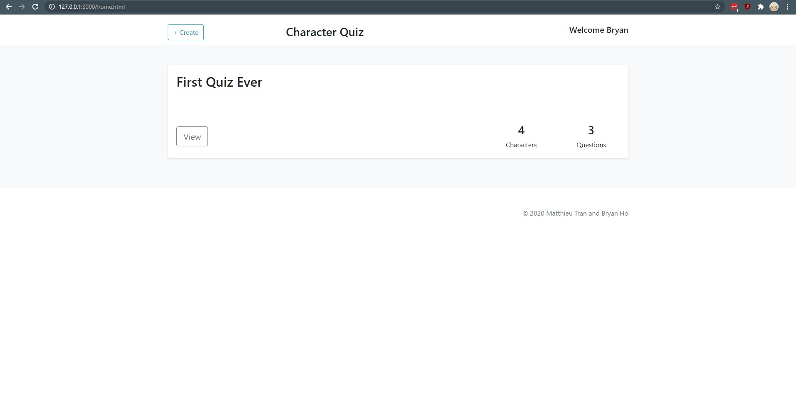
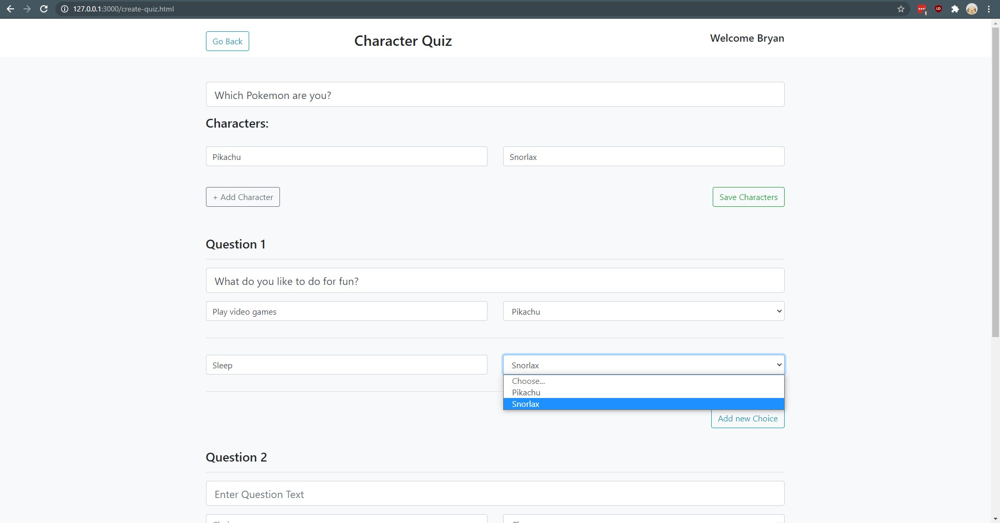
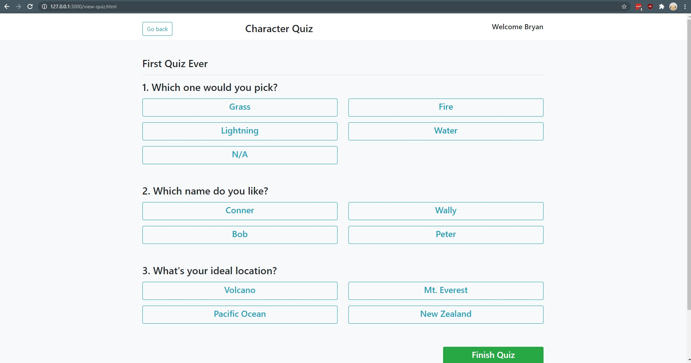

# Create your own Character Quiz

> By Bryan Ho and Matthieu Tran

## Setup

1. Clone or download this repository into your local machine
2. Navigate into the project folder using `cd`
3. Open the project folder with Visual Studio code
4. Install the Live Server extension for VS code and use it to start up a local host for the web application

## Features

- Login / Sign up as a user
- Create Custom character quizzes
- Take your own custom character quiz

## Screenshots

